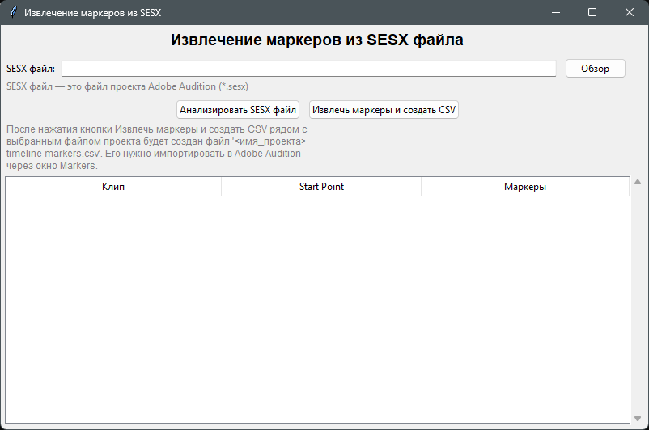
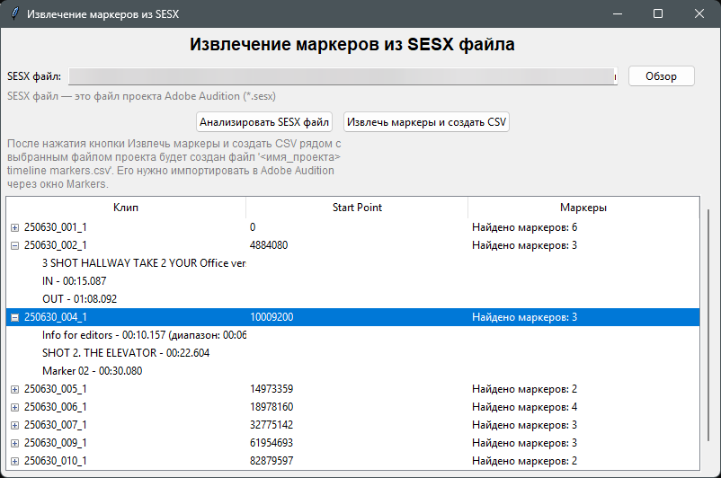
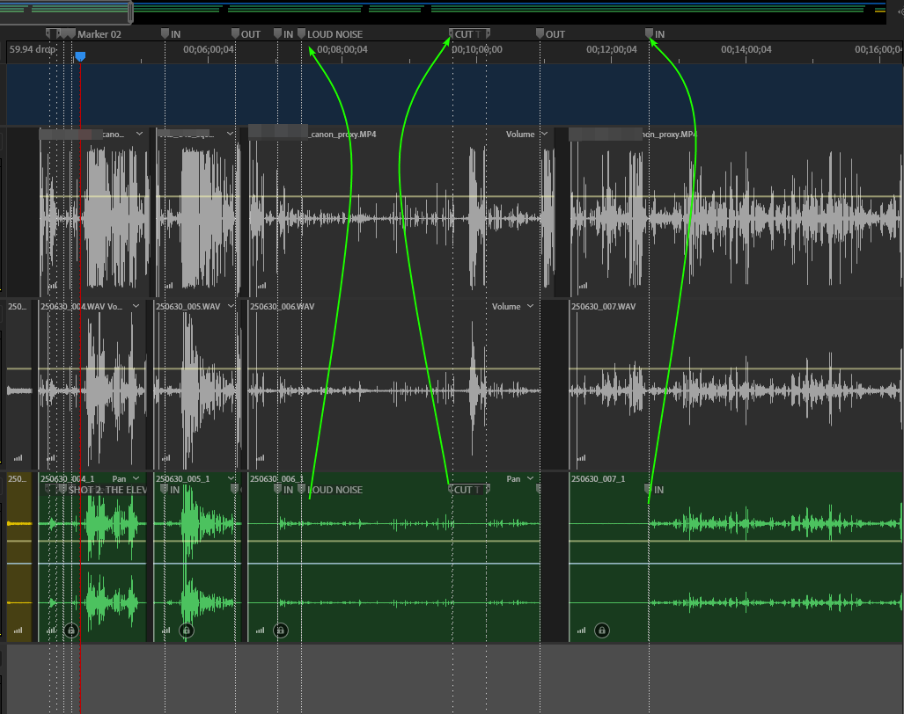

# Markers Extractor

В Adobe Audition невозможно напрямую переместить маркеры, созданные в режиме Waveform, в окно таймлайна Multitrack. Эта утилита решает эту проблему: она автоматически извлекает маркеры из WAV-файлов и размещает их на таймлайне согласно позициям клипов, описанных в файле проекта Adobe Audition (SESX-файл).

## Как это работает
- Утилита анализирует файл проекта Adobe Audition (расширение .sesx) и определяет, где на таймлайне расположен каждый WAV-файл.
- Из этих WAV-файлов извлекаются встроенные маркеры (в том числе диапазоны).
- Для каждого маркера вычисляется его абсолютная позиция на таймлайне с учётом смещения клипа.
- Результат сохраняется в CSV-файл, совместимый с Adobe Audition.

## Как это выглядит

### Анализ файла проекта

### Извлечение маркеров и создание CSV

## Использование
- Запуск через `run_extractor.bat` (Windows) или вручную через `python markers_extractor.py`
- В интерфейсе выбрать SESX-файл (файл проекта Adobe Audition), нажать "Анализировать файл проекта", затем "Извлечь маркеры и создать CSV"

## Требования
- Python 3.6+
- Наличие интернета для установки зависимостей (автоматически)

## Результат
- CSV-файл с абсолютными таймкодами всех маркеров. Готов для импорта в Audition.

---
Проект под лицензией MIT

100% Vibe coding. Автор не написал ни строчки.
